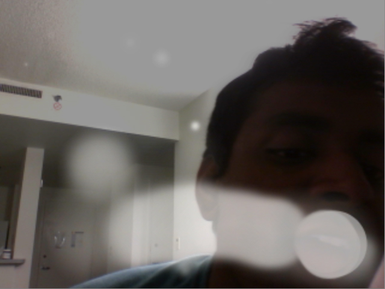

snoblo
======

This application is one of the projects I created for LMC 2700: Intro to Computational Media. In this assignment, I was challenged to write a procedural drawing program that uses an alternative metaphor for drawing. While most people think of art in terms of pencils and paints, my application speaks to how art can be created on non-conventional canvases.

### Instructions

- Blow into the microphone to fog the screen.
    - Fog will form where your mouth is, so make sure it's in the frame.
- Click and drag the mouse to draw on the fog.
- Press 'r' to clear the canvas.

### Project Statement

This project was inspired by my childhood winter days. Before driving me to school, my mom would have to defrost the car windows before we could drive to school. I would often draw on the windows and watch my pictures fade away as the car was warming up. My project SnoBlo aspires to simulate the joy of drawing on a foggy window. I utilized the OpenCV library to implement computer vision in my application, so my program will track the location of the user's mouth. I also implemented microphone input so the user can blow or make noise to fog up the screen. Fog is produced where the program detects a mouth, so the user must move their head around to cover different parts of the screen. The user can also draw marks on the fog, which will eventually fade away back into the original canvas.

I wanted to make this project to represent 1) the scientific basis of art and 2) the temporary nature of many artistic mediums. Although many people mentally separate science from art, the two are physically related. For instance, mixing together paint alters the visible wavelengths that are perceived by the human eye, as different pigments absorb and reflect different wavelengths of light. Likewise, humidity, condensation, and states of matter are all scientific topics that are involved when fogging up a window. Most people do not think of the science that goes on in seemingly basic tasks. Additionally, this program is structured so that whatever the user draws will eventually disappear. Any fog blown onto the screen will evaporate, and any marks drawn on the window will eventually fog up again. Many mediums such as old hard drives and game cartridge chips eventually lose their data as time passes. My project demonstrates this phenomenon, and it encourages people to have as much fun with condensation art as they can while it still exists. Nothing is truly permanent.

I had two of my roommates try out my application, but they used SnoBlo in ways I did not expect. They had difficulties blowing into the microphone, so they decided to shout into the microphone instead. Because my application picks up audio based on volume, any noise (not just blowing) will register a drawing. Additionally, one of my roommates had difficulties getting his face in the frame of my webcam, so my program couldn't detect his mouth easily. OpenCV's computer vision capabilities are definitely remarkable, but many false detections occur with the algorithm. Processing isn't a medium that's meant to do heavy computer vision algorithms, so it's reasonable to expect it to not always work in that regard.

Personally, I thought my application was easy to use, but that's only because I created it and knew how to use it throughout its development. I'll try to make my next projects more intuitive for the user, but for this given project, there's only so much Processing can do for the goals I want to accomplish.

This program may be hard to use. Play around with it and see if you can get it to paint the way you want it to.
